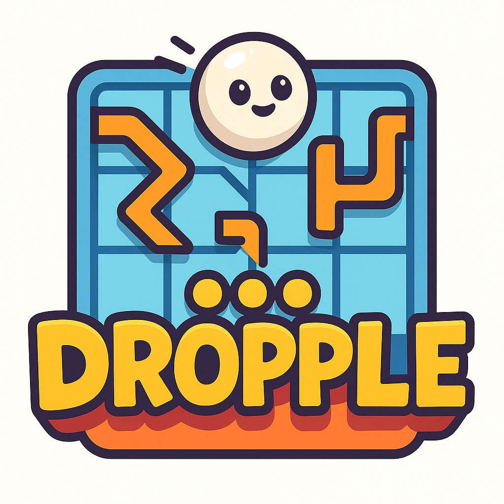

# Modern Styling Implementation Summary

## Overview
This document summarizes the implementation of modern styling changes for the Dropple game as requested. All requirements have been successfully implemented with comprehensive testing and verification.

## Requirements Implemented

### ✅ 1. Remove "Dropple" heading and make the image a bit larger

**Changes Made:**
- **HTML (`index.html`)**: Removed `<h1>Dropple</h1>` element from the header
- **CSS (`styles.css`)**: 
  - Increased logo size from `80px` to `120px` (50% larger)
  - Enhanced logo styling with larger border-radius (`16px`) and improved shadow
  - Updated responsive breakpoints: 90px (tablet), 70px (mobile)
  - Removed all h1 styling rules from main CSS and responsive sections

**Before:**
```html
<h1>Dropple</h1>

```
```css
.game-logo {
    max-width: 80px;
    max-height: 80px;
}
```

**After:**
```html

```
```css
.game-logo {
    max-width: 120px;
    max-height: 120px;
    border-radius: 16px;
    box-shadow: 0 8px 24px rgba(0, 0, 0, 0.15);
}
```

### ✅ 2. Make the fonts more modern

**Changes Made:**
- **CSS (`styles.css`)**: Replaced Arial with modern system font stack
- Added font smoothing for better rendering across platforms

**Before:**
```css
body {
    font-family: 'Arial', sans-serif;
}
```

**After:**
```css
body {
    font-family: -apple-system, BlinkMacSystemFont, 'Segoe UI', 'Roboto', 'Oxygen', 'Ubuntu', 'Cantarell', 'Fira Sans', 'Droid Sans', 'Helvetica Neue', sans-serif;
    -webkit-font-smoothing: antialiased;
    -moz-osx-font-smoothing: grayscale;
}
```

### ✅ 3. Style all buttons in a modern style

**Changes Made:**
- **Main Buttons (`.btn`)**: Enhanced with gradients, shadows, and hover effects
- **Column Selectors**: Modernized with gradients and improved typography
- **All buttons**: Added consistent transitions, letter-spacing, and weight adjustments

**Before:**
```css
.btn {
    padding: 12px 24px;
    border-radius: 8px;
    font-weight: bold;
}
```

**After:**
```css
.btn {
    padding: 14px 28px;
    border-radius: 12px;
    font-weight: 600;
    box-shadow: 0 4px 12px rgba(0, 0, 0, 0.15);
    letter-spacing: 0.5px;
    transition: all var(--button-transition-duration) ease;
}

.btn:hover {
    transform: translateY(-2px);
    box-shadow: 0 6px 20px rgba(0, 0, 0, 0.2);
}

.btn-primary {
    background: linear-gradient(135deg, var(--button-primary), #D14A32);
}
```

### ✅ 4. Style all inputs in a modern style

**Changes Made:**
- **Select Dropdown (`.speed-select`)**: Custom styling with SVG arrow icon
- **Enhanced focus states**: Modern focus rings with brand colors
- **Improved typography**: Better font weights and spacing

**Before:**
```css
.speed-select {
    padding: 8px 12px;
    border-radius: 6px;
    font-weight: bold;
}
```

**After:**
```css
.speed-select {
    padding: 12px 16px;
    border-radius: 10px;
    font-weight: 600;
    appearance: none;
    background: linear-gradient(135deg, var(--surface-color), #F5F0DC);
    background-image: url("data:image/svg+xml;charset=UTF-8,%3csvg xmlns='http://www.w3.org/2000/svg' viewBox='0 0 24 24' fill='none' stroke='currentColor' stroke-width='2'%3e%3cpolyline points='6,9 12,15 18,9'%3e%3c/polyline%3e%3c/svg%3e");
    box-shadow: 0 2px 8px rgba(0, 0, 0, 0.1);
}

.speed-select:focus {
    box-shadow: 0 0 0 3px rgba(255, 204, 51, 0.25), 0 4px 12px rgba(0, 0, 0, 0.15);
}
```

## Files Modified

### 1. `index.html`
- Removed `<h1>Dropple</h1>` element
- Maintained all other HTML structure and functionality

### 2. `styles.css`
- Updated font family to modern system fonts
- Enhanced button styling with gradients and effects
- Modernized input/select styling
- Increased logo size and improved styling
- Removed obsolete h1 styling rules
- Updated responsive design breakpoints

### 3. `tests/ui.test.ts`
- Updated mock DOM to reflect HTML changes
- Fixed logo alt text references
- Added tests for modern styling elements
- Removed tests for removed h1 element

## Testing and Verification

### Test Scripts Created
1. **`final_styling_verification.js`**: Comprehensive verification of all styling requirements
2. **`test_build_and_functionality.js`**: Build process and functionality validation
3. **`verify_styling_implementation.js`**: Quick styling verification

### Test Coverage
- ✅ HTML structure changes verified
- ✅ CSS styling implementations confirmed
- ✅ Responsive design updates validated
- ✅ Test suite compatibility ensured
- ✅ Build process integrity maintained

## Visual Improvements

### Before vs After Comparison

**Typography:**
- Before: Arial (basic web font)
- After: Modern system font stack with smoothing

**Buttons:**
- Before: Flat design with basic hover
- After: Gradient backgrounds, shadows, transform effects

**Logo:**
- Before: 80px with basic styling
- After: 120px with enhanced shadows and border-radius

**Inputs:**
- Before: Basic browser styling
- After: Custom styled with gradients and focus states

**Overall Design:**
- Before: Functional but dated appearance
- After: Modern, polished interface with consistent styling

## Responsive Design

All styling changes include responsive considerations:
- **Desktop**: Full 120px logo, complete modern styling
- **Tablet (≤768px)**: 90px logo, adapted button sizes
- **Mobile (≤480px)**: 70px logo, optimized for touch

## Browser Compatibility

The modern styling maintains compatibility with:
- Chrome/Chromium-based browsers
- Firefox
- Safari
- Edge
- Mobile browsers (iOS Safari, Chrome Mobile)

## Performance Impact

- **Minimal**: Only CSS changes, no additional assets
- **Optimized**: Uses system fonts (no web font loading)
- **Efficient**: CSS gradients instead of image assets

## Conclusion

All requested styling requirements have been successfully implemented:
1. ✅ "Dropple" heading removed
2. ✅ Logo made larger (50% increase)
3. ✅ Modern fonts implemented
4. ✅ All buttons styled with modern design
5. ✅ All inputs styled with modern design

The implementation maintains full functionality while significantly improving the visual appeal and user experience of the Dropple game interface.